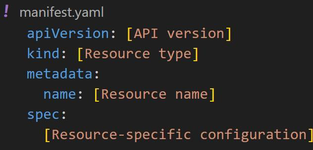

# Basic Structure of Manifest File

Basic Manifest File Structure example:

<figure><figcaption></figcaption></figure>

Basic Manifest components and its description:

<table><thead><tr><th width="137.39996337890625">Component</th><th width="319.4000244140625">Description</th></tr></thead><tbody><tr><td>apiVersion</td><td>Specifies which version of the</td></tr><tr><td>Kubernetes</td><td>API to use</td></tr><tr><td>kind</td><td>Type of resource you are creating.</td></tr><tr><td>metadata</td><td>Information about resource</td></tr><tr><td>spec</td><td>Details about resource to be created</td></tr></tbody></table>

